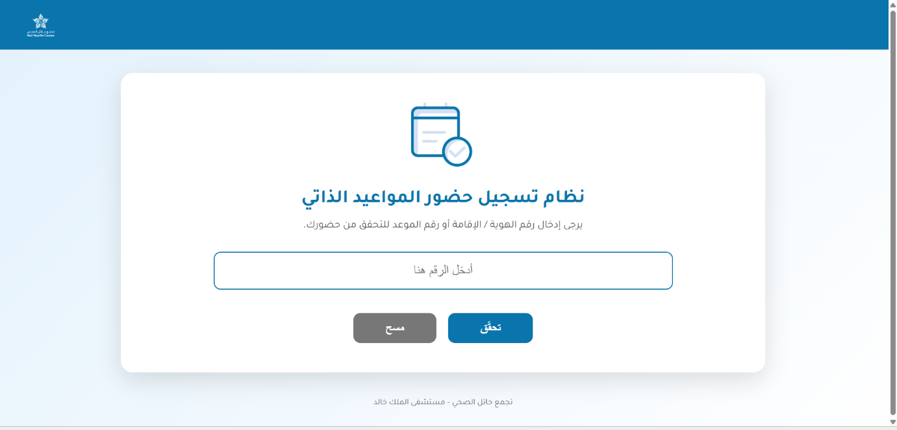
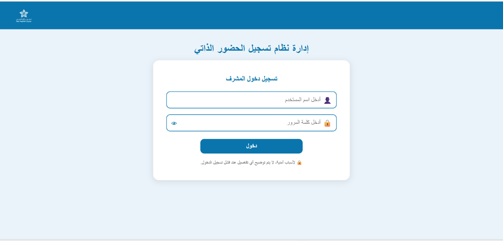
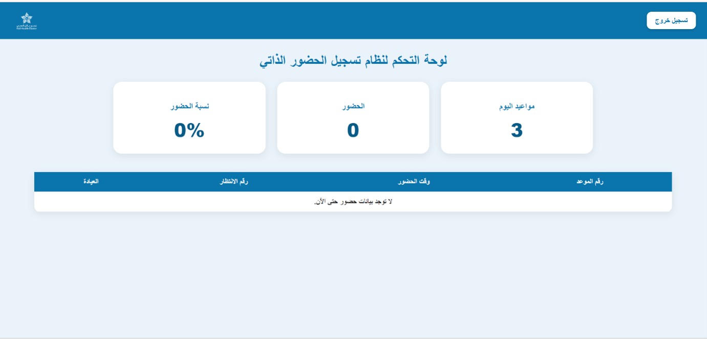
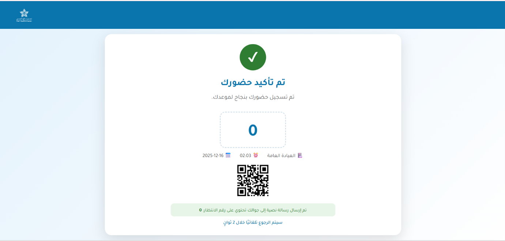
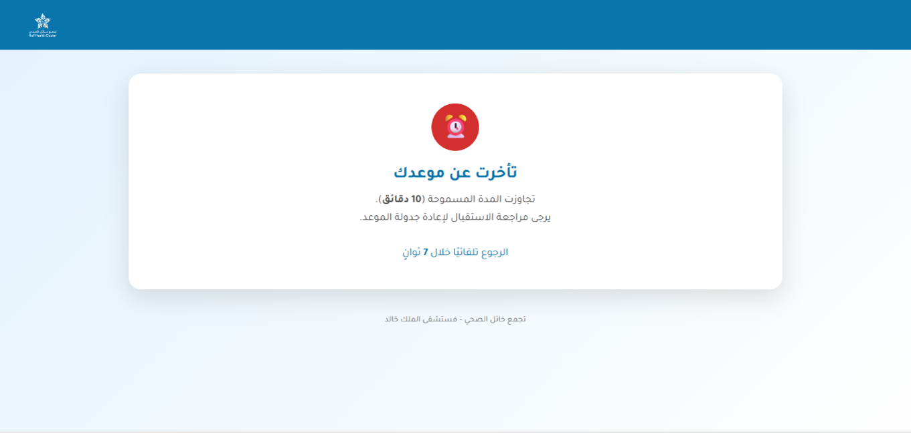

# Self Check-in System | نظام تسجيل الحضور الذاتي

An Arabic (RTL) web application that lets patients check in for their appointments on a kiosk screen, receive a queue number, and lets admins monitor attendance on a live dashboard.

نظام ويب عربي يتيح للمريض تسجيل حضوره لموعده ذاتيًا عبر شاشة، والحصول على رقم انتظار، مع لوحة تحكم للمشرف لمتابعة الحضور.

> Training project. Uses demo data only, no real patient information.
> مشروع تدريبي، يستخدم بيانات تجريبية فقط.

## Features | المميزات

- Check-in using national ID, iqama number, or appointment number
- Input validation (10 digits for ID/iqama, 15 characters for appointment number)
- Time-window rules: up to 30 minutes early and up to 10 minutes late
- Automatic queue number per day
- Clear status screens with auto-redirect: success, already checked in, not today, too early, too late, not found, error
- Admin login and dashboard: today appointments, attendance count, attendance rate, latest check-ins

## Screenshots | لقطات من النظام

### Check-in Page | صفحة تسجيل الحضور



### Admin Login | تسجيل دخول المشرف



### Admin Dashboard | لوحة تحكم المشرف



### Successful Check-in | نجاح تسجيل الحضور



### Late Check-in | الحضور متأخرًا


## Tech Stack | التقنيات

PHP (MySQLi, prepared statements) · MySQL · HTML / CSS / JavaScript · Tajawal font

## Project Structure | هيكل المشروع

```text
├── index.php          # redirects to the check-in page
├── config/            # database connection (db.example.php)
├── assets/            # css and images
├── pages/             # patient-facing pages
├── admin/             # admin login and dashboard
└── database/          # schema.sql
